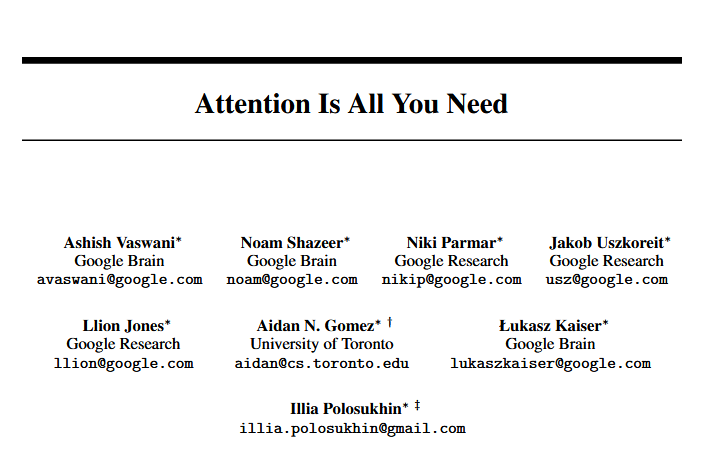
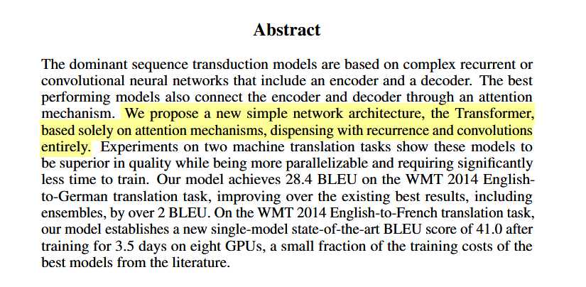
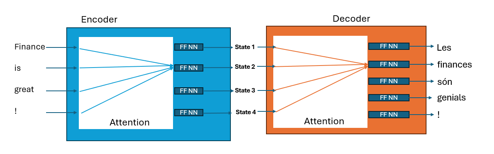
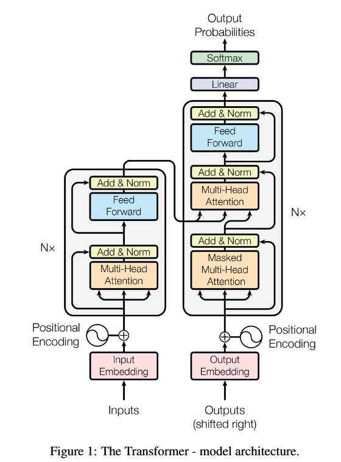

# Understanding Transformers: Step by Step

## What is a Transformer?

- Revolutionary neural network architecture introduced in "Attention Is All You Need" (2017)
- **Key innovation**: Replaces recurrence and convolutions entirely with attention mechanisms
- Enables **parallel processing** of sequences (unlike RNNs)
- Foundation for modern LLMs including GPT-2, GPT-3/4, BERT

## Transformer Evolution

## A Visual Representation

## The Big Picture: Transformer Architecture

- **Encoder-Decoder Structure**: Input → Encoder → Decoder → Output
- **Self-Attention**: Each position can attend to all positions in previous layer
- **Parallelizable**: No sequential dependencies like RNNs

## Quick Transformer recipe (plain-English version)

### 1. Get the words ready
- **Break the sentence into tokens** (small pieces: words or sub-words).  
- **Turn each token into a list of numbers** (a vector).  
- **Add its place in the sentence to that list** so the model knows the order.

### 2. Encoder – do this **N** times
- Each token **looks at all the other tokens** and decides which ones matter most for its meaning.  
- The token’s vector then **goes through a small neural network** that tweaks it.  
- A **shortcut adds the old vector to the new one**, and a quick re-scaling step keeps the numbers stable.

*Result: a set of richer vectors that store everything the model has learned about the input—its “memory.”*

## Quick Transformer recipe Part 2

### 3. Decoder – do this **N** times while generating
1. **Embed** the words already produced, with their positions.  
2. Each token **can only look back at earlier tokens**, never forward, so it can’t peek at the future.  
3. It also **looks at the encoder’s memory** to find helpful parts of the source sentence.  
4. The vector again **passes through the small neural net, the shortcut, and the stabilizing step**.

### 4. Choose the next word
- The final vector is **turned into scores for every word in the vocabulary**.  
- Those scores are **converted to probabilities** (they add up to 1).  
- Pick one word (greedy, top-k, nucleus, beam search, etc.), **append it**, and repeat Step 3 until you hit an end-of-sentence token or a length limit.

## New words you just met
- **Token**: a chunk of text (often a piece of a word).  
- **Vector**: a list of numbers that represents a token.  
- **Attention**: the act of deciding how much other tokens matter.  
- **Memory**: the set of vectors coming out of the encoder.  
- **Shortcut (skip connection)**: adding the old vector to the new one so learning is smoother.

## Step 1: Input Embeddings

### Token Embeddings
- When you feed a sequence of tokens into a transformer‐based LLM, each discrete token (an integer index) is turned into a dense vector of lower dimensionality than the vocabulary size

- Let $V$ be the vocabulary size, and $N$ the sequence length 
- A token $j$ is an integer in the set $\{0, 1, \ldots, V-1\}$
- A brute force one-hot vector encoding $x \in \{0,1\}^V$
$$
x_j = \begin{cases}
1 & \text{if } j = i \\
0 & \text{otherwise}
\end{cases}
$$

- This is inefficient, especially for large vocabularies, as it results in high-dimensional sparse vectors
- Instead, we use a **learnable embedding matrix** $\mathbf{E} \in \mathbb{R}^{V \times d_{\text{model}}}$, where $d_{\text{model}}$ is typically much smaller than $V$

## Steps 1–2 · Tokens → Input Vectors  

**Step 1 — Tokenise & Embed**  
- Break the sentence into **tokens** (words or sub-words).  
- Look up each token’s **embedding** (a fixed list of numbers):  
  $$\mathbf{e}_j = \mathbf{x}_j^\top \mathbf{E}$$  
  *(turn a token ID into a vector).*

**Step 2 — Add Position Information**  
Transformers need order, so we add a **positional encoding**:  
$$
PE_{(pos,2i)}   = \sin\!\Bigl(\tfrac{pos}{10000^{2i/d_{\text{model}}}}\Bigr),\quad
PE_{(pos,2i+1)} = \cos\!\Bigl(\tfrac{pos}{10000^{2i/d_{\text{model}}}}\Bigr)
$$  
**Input vector** $=$ embedding $+$ position.  

---

## Steps 3–4 · Create Attention Weights  

**Step 3 — Queries, Keys, Values**  
For every input vector $\mathbf{x}_i$:  
$$
\mathbf{q}_i = \mathbf{x}_i\mathbf{W}^Q,\quad
\mathbf{k}_i = \mathbf{x}_i\mathbf{W}^K,\quad
\mathbf{v}_i = \mathbf{x}_i\mathbf{W}^V
$$  
These three vectors let each token compare itself with every other token.

**Step 4 — Attention Calculation**  
$$
\text{Attention}(\mathbf{Q},\mathbf{K},\mathbf{V})
=
\underset{\text{weights}}{\text{softmax}\!\Bigl(\tfrac{\mathbf{Q}\mathbf{K}^\top}{\sqrt{d_k}}\Bigr)}
\;\mathbf{V}
$$  

*Softmax:* $\displaystyle\text{softmax}(z_i)=\frac{e^{z_i}}{\sum_j e^{z_j}}$.  
Turns raw scores into probabilities that add up to 1.  

---

## Steps 5–6 · Multi-Head & Feed-Forward  

**Step 5 — Multi-Head Attention**  
Run the attention process $h$ times in parallel:  
$$
\text{head}_t=\text{Attention}(\mathbf{Q}\mathbf{W}^Q_t,\,
\mathbf{K}\mathbf{W}^K_t,\,
\mathbf{V}\mathbf{W}^V_t)
$$  
$$
\text{MultiHead}=\text{Concat}(\text{head}_1,\dots,\text{head}_h)\,\mathbf{W}^O
$$  
Each head can learn a different pattern (nearby words, long-distance links, syntax, …).

**Step 6 — Feed-Forward Layer (per position)**  
$$
\text{FFN}(x)=\underbrace{\max(0,\,x\mathbf{W}_1+\mathbf{b}_1)}_{\text{ReLU}}\,
\mathbf{W}_2+\mathbf{b}_2
$$  
*ReLU:* $\text{ReLU}(u)=\max(0,u)$ — keeps positives, zeroes negatives.

---

## Steps 7–8 · Residuals, LayerNorm & Probabilities  

**Step 7 — Keep Training Stable**  
- **Residual (skip) connection:** $x+\text{sublayer}(x)$  
  *(sublayer = Multi-Head or FFN).*  
- **Layer Normalization** rescales the result:  
  $$\text{LayerNorm}(u)=\frac{u-\mu}{\sigma}\gamma+\beta$$  
  so its mean = 0 and variance = 1.

**Step 8 — From Vectors to Words**  
1. A **linear layer** turns the final hidden vector into one score per vocabulary word (logits).  
2. **Softmax** on those logits → probabilities.  
3. Pick the next token (greedy, top-$k$, nucleus, beam, …), append it, and repeat the decoder loop until an ⟨EOS⟩ token or length limit is reached.

## Transformer Model Applications

- **Machine Translation**: Original use case in "Attention Is All You Need"
- **Text Generation**: Foundation for GPT models
- **Document Understanding**: BERT and its variants
- **Multimodal Applications**: Vision transformers, audio transformers
- **Financial Applications**: Market prediction, sentiment analysis, report generation

## GPT-2: A Landmark Decoder-Only Model

### GPT-2 Architecture Basics

- Released by OpenAI in 2019
- Decoder-only transformer architecture
- Trained on 40GB of internet text
- Available in different sizes:
  - Small: 117M parameters
  - Medium: 345M parameters
  - Large: 762M parameters
  - XL: 1.5B parameters

## GPT-2: Model Architecture Details

- Uses masked self-attention (can only attend to previous tokens)
- No encoder-decoder structure, just the decoder component
- Trained on a simple next-token prediction objective
- Layer configuration (for 1.5B model):
  - 48 layers
  - 1600 dimensional embeddings
  - 25 attention heads

## GPT-2: Key Innovations

- Demonstrated impressive zero-shot capabilities
- Introduced **unsupervised pre-training** at scale
- Showed that scaling model size and data substantially improves performance
- Established the foundation for subsequent models like GPT-3 and GPT-4
- Pioneered better sampling methods for text generation

## Sampling Strategies: Introduction

- After the model computes the probability distribution for the next token, how do we select it?
- Different sampling methods produce different text qualities and characteristics
- Trade-off between:
  - **Determinism**: Consistent, predictable outputs
  - **Creativity**: Novel, diverse text generation
  - **Coherence**: Staying on topic without degrading

## Sampling Strategy: Greedy Decoding

- **Approach**: Always select the most probable next token
- **Formula**: $y_t = \arg\max_w P(w|y_{<t})$

### Advantages:
- Simple to implement
- Often produces coherent text for short sequences
- Deterministic results

### Disadvantages:
- Lacks diversity
- Can get stuck in repetition loops
- May produce suboptimal overall sequences

## Sampling Strategy: Temperature Sampling

- **Approach**: Sample from softmax distribution with temperature adjustment
- **Formula**: $P(w|y_{<t}) = \frac{\exp(z_w/T)}{\sum_{w'} \exp(z_{w'}/T)}$

### Temperature effects:
- $T < 1$: Makes distribution more peaked (less random)
- $T > 1$: Makes distribution more uniform (more random)
- $T = 1$: Standard softmax, no adjustment
- $T \to 0$: Approaches greedy decoding

## Sampling Strategy: Top-K Sampling

- **Approach**: Limit sampling to the K most likely next tokens
- **Procedure**:
  1. Sort the vocabulary by probability
  2. Keep only the top K tokens
  3. Renormalize probabilities
  4. Sample from this smaller distribution

### Advantages:
- Reduces chance of selecting low-probability (potentially nonsensical) tokens
- Maintains some randomness
- Often produces more coherent text than pure sampling

### Disadvantages:
- K is a fixed hyperparameter regardless of confidence distribution
- May be too restrictive for some contexts, too permissive for others

## Sampling Strategy: Nucleus (Top-p) Sampling

- **Approach**: Sample from the smallest set of tokens whose cumulative probability exceeds threshold p
- **Procedure**:
  1. Sort tokens by probability
  2. Keep adding tokens until cumulative probability ≥ p
  3. Renormalize and sample from this dynamic set

### Advantages:
- Adapts to the confidence of the model
- More flexible than Top-K
- Current standard for high-quality text generation

### Disadvantages:
- Slightly more complex to implement
- Still requires tuning the p parameter (typically 0.9-0.95)

## Sampling in Financial Applications

### Conservative Approach (Low Temperature/High Precision):
- Regulatory reporting
- Earnings statement generation
- Financial advice

### Creative Approach (Higher Temperature/More Exploration):
- Market scenario generation
- Stress testing
- Alternative investment thesis formulation

## Putting It All Together: The Transformer Revolution

- Transformers dramatically improved NLP capabilities through:
  - **Parallelization**: Training efficiency
  - **Attention Mechanism**: Better at capturing relationships
  - **Scalability**: Performance continues to improve with size

- Led to a new paradigm of foundation models
- Enabled financial applications previously considered impossible
- Continues to evolve with each new model generation

